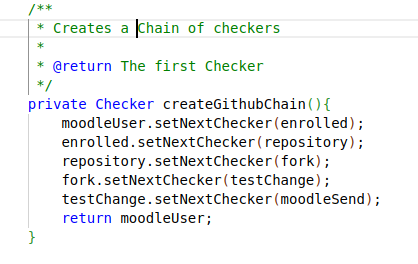
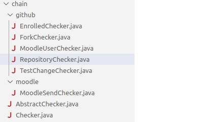
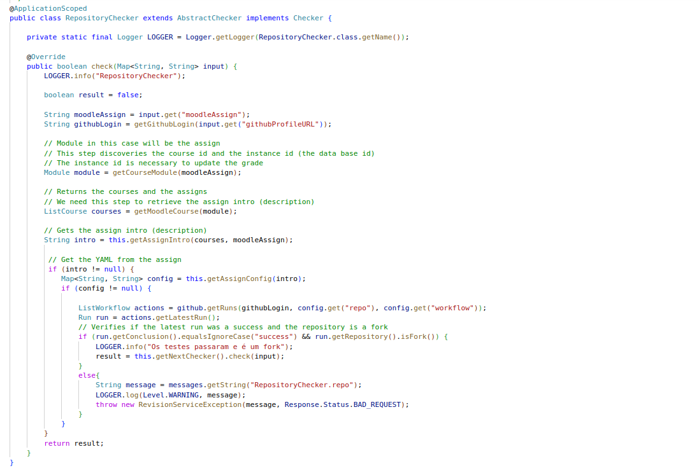

---
author:
- Alexandre de Mesquita Fabian
title:
- Padrões de Projeto

---

# Padrão:

Chain of Responsability é um padrão de projeto comportamental

## Características

- Tem como caracteristica permitir  que se passe requisições por uma corrente de processamento, que podem ser chamados de handlers.
- Evitando o acoplamento do remetente ao receptor, ao dar a mais de um objeto a oportunidade de tratar a solução (GAMMA et al., 2000)
- O Padrão é composto de um objeto de cliente e um grupo de handlers.  

## Handlers

- Cada handler decide se passa para o próximo ou quebra a
corrente, encerrando o processamento nesse ponto, não deixando que os demais membros da corrente percam tempo.
- Reduz a complexidade do problema a ser tratado por cada
handler.
- Deixa os objetos mais simples e **fáceis de implementar e
manter.**

## Quando Aplicar

- Quando mais de um objeto precisa processar uma requisição
- Quando os handlers precisam de uma ordem especifica para serem executados.
- Quando os handlers utilizados e sua ordem podem ser mudados dinamicamente 

## Vantagens

- É possivel controlar a ordem que a requisição irá passar pelos handlers
- Principio de Responsabilidade Única. 
- Principio do Aberto / Fechado, é possível adicionar novos handlers sem quebrar o código existente.

Reduz a complexidade dos objetos e o acoplamento

## Desvantagens

- Algumas requisições podem ficar sem tratamento

## Como aplicar

- Declarar uma **interface** para o Handler;
- um Handler **base** com código comum aos demais;
- os Handlers **concretos**; 
- e o **Cliente** que irá compor a corrente

## Exemplo
### Sobre o exemplo
A motivação para a criação do Revision Web Service advém da necessidade de facilitar a correção e aplicação da nota no Moodle dos exercícios de programação realizados pelos alunos utilizando a plataforma Github. Através de ferramenta específica do Github é possível criar tarefas e automatizar a avaliação das mesmas e utilizando-se do Revision Web Service será possível publicar o resultado desta avaliação na plataforma de ensino Moodle.

>Chain do Projeto Revision  
>

\newpage

>Lista de Checkers  
>

>Exemplo de Checker Concreto  

\newpage

[Link para o projeto no Github](https://github.com/orion-services/revision)

## Referências

- SHVETS, Alexander. Dive Into Design Patterns. Kamianets-Podilskyi, Ucrânia. Refactoring.Guru, 2019. 409 p.

- GAMMA, Erich; JOHNSON, Ralph; HELM, Richard; VLISSIDES, John. Padrões de Projetos: oluções reutilizáveis de software orientados a objetos. São Paulo: Bookman, 2000. 360 p. Tradução Luiz A. Meirelles Salgado.
