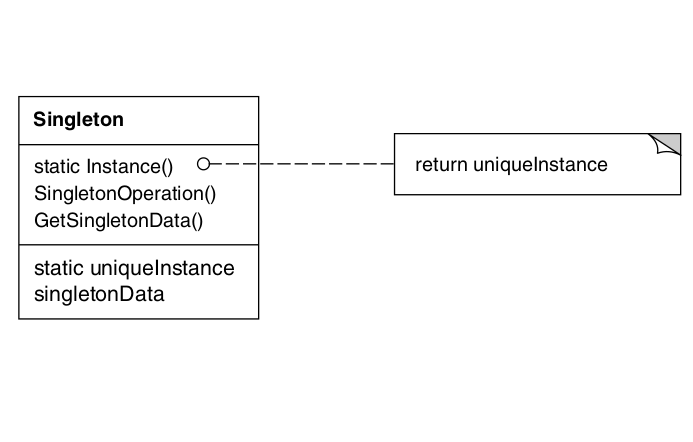
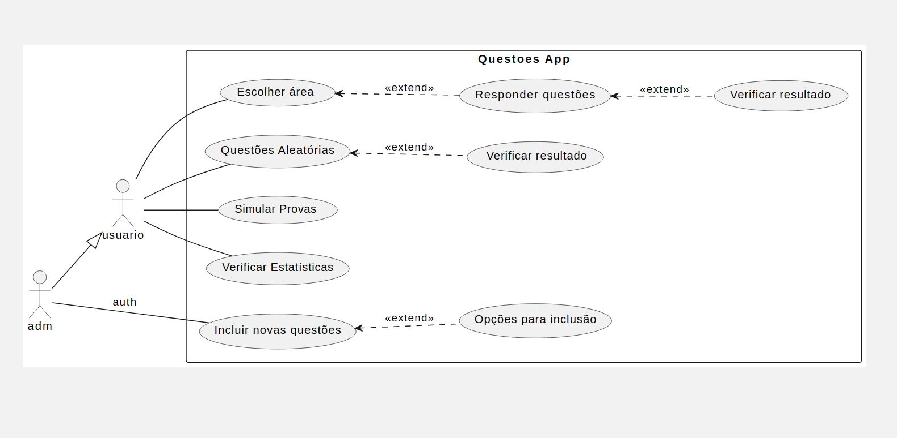
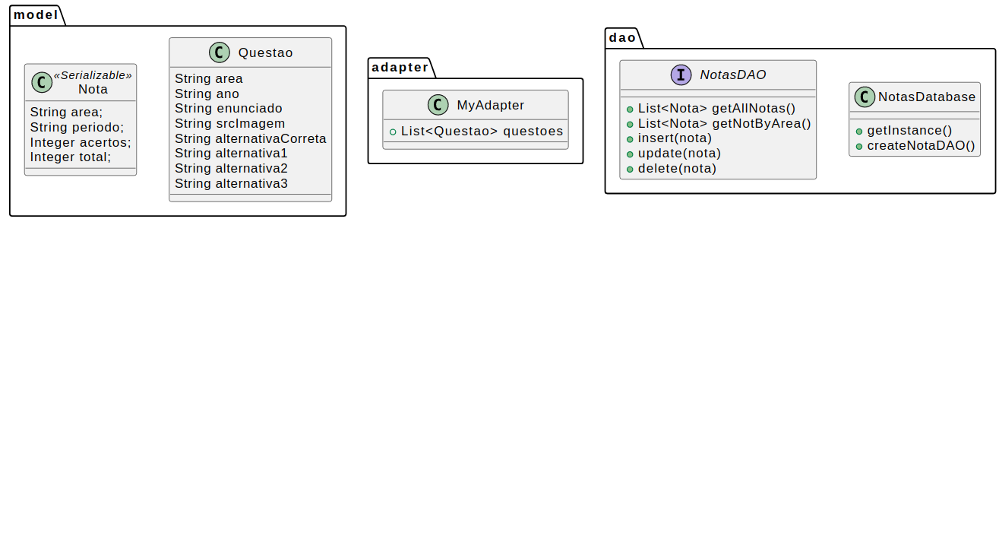
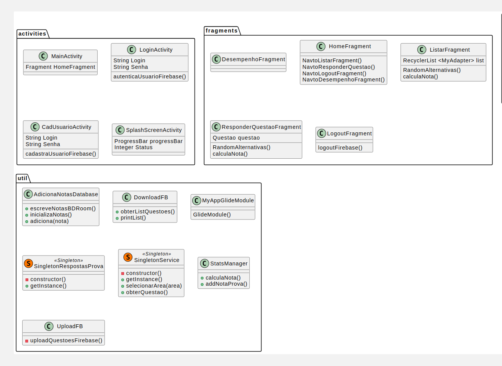
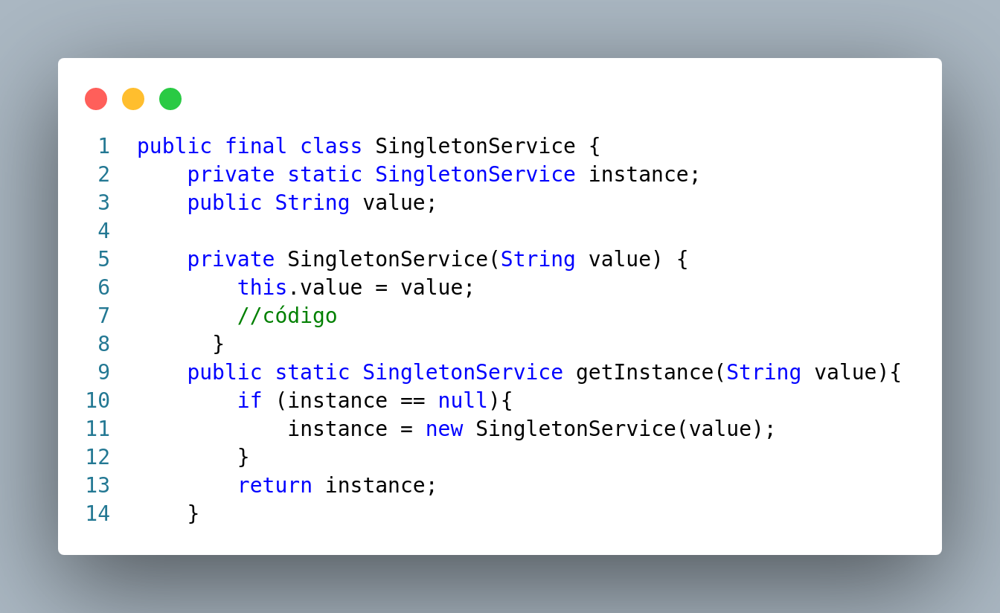
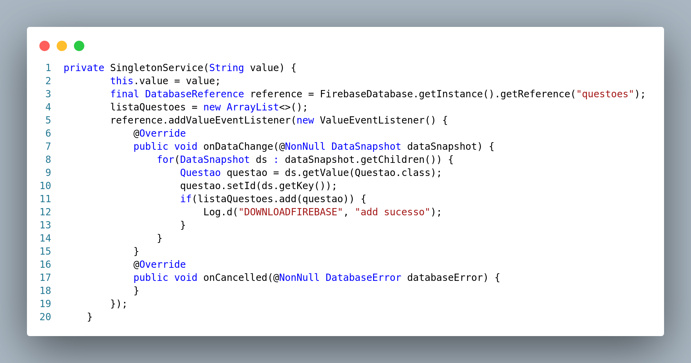
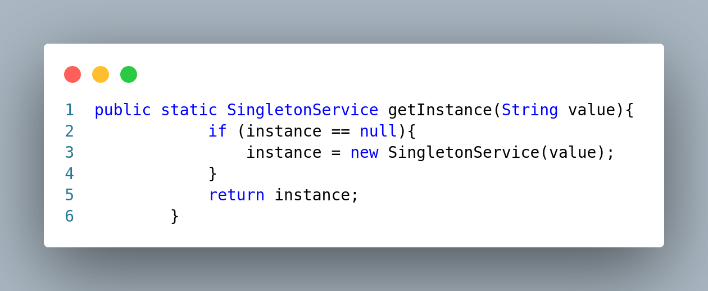

---
title:
- Padrão de Projeto
author:
- Alexandre Fabian
theme:
- Copenhagen
fontsize:
- 12pt
---

# Padrão:

\Huge Singleton\par

# Projeto:

\Large App Questoes \par
  
  
\large Projeto utilizando Linguagem Java para a plataforma Android de PW3\par

# Singleton

\Large É um padrão de projeto criacional\par

# Intenção

- \Large Garantir que uma classe tenha somente uma instância e  \par
   

- \Large fornecer um ponto global de acesso para a mesma. (GAMMA et al., 2000)\par

# ...  
- \Large O Singleton pode ser reconhecido por um método de criação estático, que retorna o mesmo objeto em cache. \par

# Motivação
\large É importante para algumas classes ter uma, e apenas uma, instância.   \par  
   
- \Large Como garantimos que uma classe tenha somente uma instância e que essa instância seja facilmente acessível?   \par

# Possivel Resposta
- \large Uma variável global torna um objeto acessível, mas não impede você de instanciar múltiplos objetos.   \par  

# ...
- \Large Uma solução melhor seria tornar a própria classe responsável por manter o controle da sua única instância.   \par  
   

# ...
- \Huge Este é o padrão Singleton   \par  
   
# Use o padrão Singleton quando:

- \large for preciso haver apenas uma instância de uma classe, e essa instância tiver que dar acesso aos clientes através de um ponto bem conhecido; \par
  
# Use o padrão Singleton quando:

- \large a única instância tiver de ser extensível através de subclasses, possibilitando aos clientes usar uma instância estendida sem alterar o seu código. \par

# Estrutura

# Vantagens:

1. \Large Acesso controlado à instância única. \par
  

2. \Large Espaço de nomes reduzido. \par
  

3. \Large Permite um refinamento de operações e da representação. \par

# Vantagens:

4. \Large Permite um número variável de instâncias: \par  
   
  \normalsize O padrão torna fácil mudar de idéia, permitindo mais de uma instância da classe Singleton. \par  

# Desvantagens

- \Large Muitos desenvolvedores consideram o padrão Singleton um antipadrão. É por isso que seu uso está diminuindo no código Java. (SHVETS, 2019) \par

# Como aplicar:
## Garantindo uma única instância.
- Ocultando a operação que cria a instância, usando uma operação com  uma função-membro **estática**
- esta operação tem acesso a variável que mantém a única instância,
- e garante que seja iniciada uma unica vez antes de retornar o seu conteúdo.
  

# Sobre o exemplo

\Large App para treinar questões do Encceja:  \par
- \large Banco banco de dados no Firebase para as questões e Storage das imagens. \par
- \large Banco de dados local para guardar as informações de desempenho \par

# Casos de uso

# Diagrama de Classes

# Diagrama de Classes

  

# Exemplo da utilização do Singleton

# Exemplo da utilização do Singleton

# Exemplo da utilização do Singleton

# Screenshots do App: Home e Sobre

# Screenshots do App: Escolha Área e Desempenho

# Sobre

- [Link para video de demonstracao](https://github.com/amfabian/docs/tree/main/ES3/singleton/demo.mp4).  
  
- [Link para a apresentação no Github](https://github.com/amfabian/docs/tree/main/ES3/singleton).

- [Link para o App no Github](https://github.com/amfabian/QuestoesApp).

# Referências

- SHVETS, Alexander. Dive Into Design Patterns. Kamianets-Podilskyi, Ucrânia. Refactoring.Guru, 2019. 409 p.

- GAMMA, Erich; JOHNSON, Ralph; HELM, Richard; VLISSIDES, John. Padrões de Projetos: Soluções reutilizáveis de software orientados a objetos. São Paulo: Bookman, 2000. 360 p. Tradução Luiz A. Meirelles Salgado.